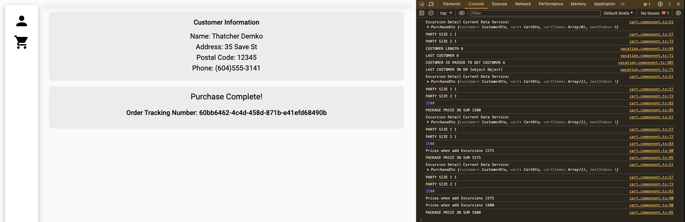
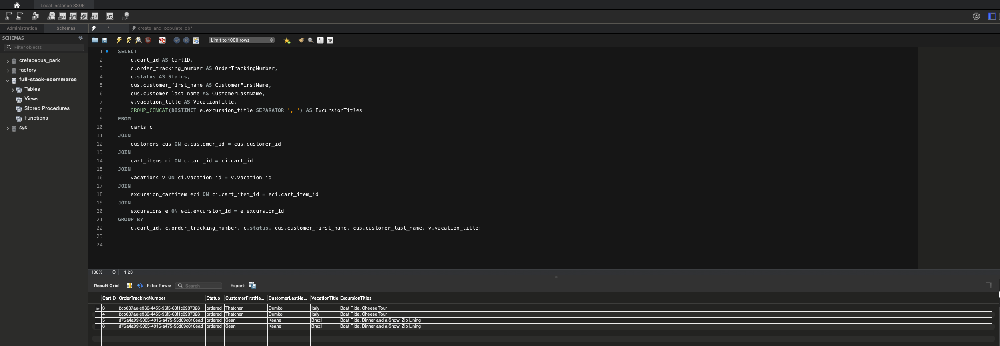
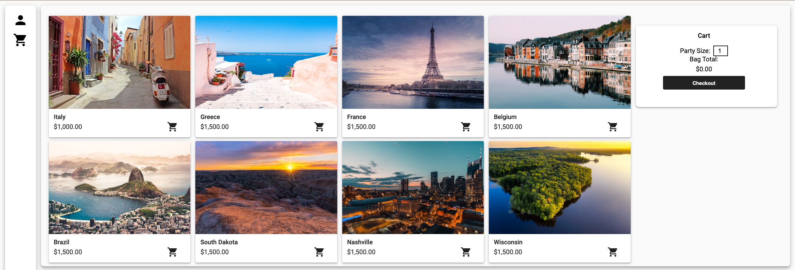

# Seans Vacation Tracker

#### This MVP website was built to provided specifications for my college course D288.

# _Backend Programming_

#### By _**Sean Keane**_

#### WGU Code Review 06/19/2024

## Description

_This is a backend project I created for my B.S. in Software Engineering that manages a vacation booking website. The
user is able to create users for checkout and ascribe a vacation package. They are also able to select different
countries and apply excursions to that trip. Upon checkout the user is provided a total and a confirmation number for
their order. Developing this application helped me grow my understanding of Java and HTML_

### Customer Checkout

### Database query after customer orders

### Built Application

## Technology Used

* Java
* Spring Framework (Spring Boot, Spring Data JPA, Spring Data REST)
* MySQL
* Lombok

## Setup/Installation Requirements

1) Clone this repository to your desktop.
2) Navigate to the now installed directory and open in your editor of choice.
3) Run the project by clicking the play button. This is next to 'DemoApplication' in the top right of the IDE.
4) Open your browser of choice and navigate to `http://localhost:4200/vacation`.

## Known Bugs

* No known bugs.

## License

If you have any questions or concerns, feel free to contact me at code@sean-keane.com

*This is licensed under the MIT license*

Copyright (c) 06-19-2024 **_Sean Keane_**